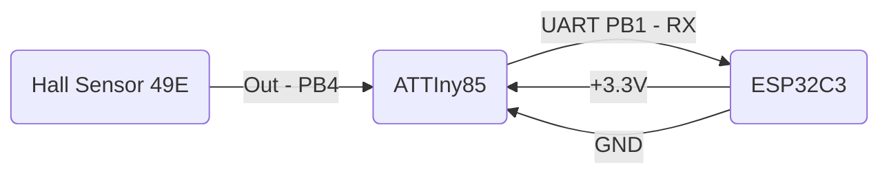

# ATTiny85 with Hall Sensor and UART

Motivation: I needed a way to read out a hall sensor and that is connected to a UART. As I didn't want to buy an expensive Hall Sensor that may be capable of UART, I decided to search for other possibilities.

Stats:
  - one-way fire and forget, no RX on ATTiny85!
  - bitrate: 28800 bps
  - readings per second: ~50 (every 20 ms)

## Connection diagram

## Performance

I setup a reading cycle loop of 20ms, resulting in 50 readings per second which should be sufficient for fast hall sensor readings. the UART connection is set to 28800 bps and is able to send ~50 readings per second, without any failures.
It is important to read out the UART on the ESP32 in the main loop without any blocking or async processing, otherwise you will get a delay of transmitted/ received data.
